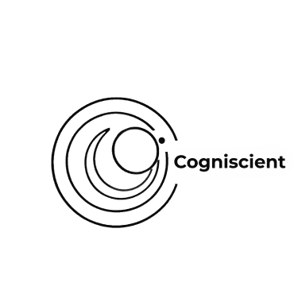

# Cogniscient



> A consultancy working at the intersection of artificial intelligence and human-centered design.

Cogniscient is a modern web application built with Next.js that showcases AI-UX consulting services. We apply deep expertise in cognitive science, machine learning, computer science, and mechanical engineering to help craft interactive AI-powered products that are intuitive, trustworthy, and efficient.

## ✨ Features

- **🎨 Modern UI/UX**: Built with Material-UI and Tailwind CSS
- **📱 Responsive Design**: Optimized for desktop and mobile devices
- **🚀 Fast Performance**: Server-side rendering with Next.js
- **♿ Accessibility**: WCAG compliant components
- **🔧 TypeScript**: Full type safety
- **🎯 Interactive Elements**: Game of Life animation and contact forms

## 🛠️ Tech Stack

- **Framework**: [Next.js 15.3.1](https://nextjs.org/)
- **Language**: [TypeScript 5.8.3](https://www.typescriptlang.org/)
- **Styling**:
  - [Tailwind CSS 4.1.3](https://tailwindcss.com/)
  - [Material-UI 7.0.2](https://mui.com/)
- **State Management**: [Redux 5.0.1](https://redux.js.org/)
- **Forms**: [React Hook Form 7.62.0](https://react-hook-form.com/)
- **Routing**: [React Router DOM 7.5.0](https://reactrouter.com/)

## 📋 Prerequisites

- **Node.js**: Version 20.0.0 or higher ([Download](https://nodejs.org/en/download/))
- **Yarn**: Package manager (recommended)

## 🚀 Quick Start

### 1. Clone the repository

```bash
git clone <repository-url>
cd cogniscient
```

### 2. Install dependencies

```bash
yarn install
```

### 3. Run the development server

```bash
yarn dev
```

### 4. Open your browser

Visit [http://localhost:3000](http://localhost:3000) to see the application.

## 📁 Project Structure

```
src/
├── app/                    # Next.js App Router pages
│   ├── articles/          # Articles section
│   ├── items/             # Items/portfolio section
│   ├── members/           # Team members section
│   ├── layout.tsx         # Root layout
│   └── page.tsx           # Home page
├── components/            # Reusable React components
│   ├── AboutCogniscient.tsx
│   ├── ContactForm.tsx
│   ├── GameOfLifeLogo.tsx
│   ├── Navbar.tsx
│   ├── SideDecoration.tsx
│   └── ...
├── pages/api/             # API routes
├── stores/                # Redux store configuration
└── globals.css            # Global styles
```

## 🧪 Available Scripts

```bash
# Development
yarn dev          # Start development server
yarn build        # Build for production
yarn start        # Start production server
yarn lint         # Run ESLint
```

## 🚀 Deployment

### Vercel (Recommended)

1. Push your code to GitHub
2. Connect your repository to [Vercel](https://vercel.com)
3. Deploy automatically on every push to main

### Manual Build

```bash
yarn build
yarn start
```

## 🎨 Design System

- **Colors**: Custom color palette with AI/tech theme
- **Typography**: Montserrat font family for modern, clean look
- **Components**: Material-UI components with Tailwind utilities
- **Responsive**: Mobile-first approach with breakpoints

## 🤝 Contributing

1. Fork the repository
2. Create your feature branch (`git checkout -b feature/amazing-feature`)
3. Commit your changes (`git commit -m 'Add some amazing feature'`)
4. Push to the branch (`git push origin feature/amazing-feature`)
5. Open a Pull Request

## 📄 License

This project is licensed under the MIT License - see the [LICENSE](LICENSE) file for details.

## 📞 Contact

For questions about this project or Cogniscient services:

- Website: [[https://cogniscient.vercel.app/](https://cogniscient.vercel.app/)]
- Email: [sunpochin@gmail.com]
- LinkedIn: [[LinkedIn Profile](https://www.linkedin.com/in/sunpochin/)]

---

Built with ❤️ using Next.js and modern web technologies.
